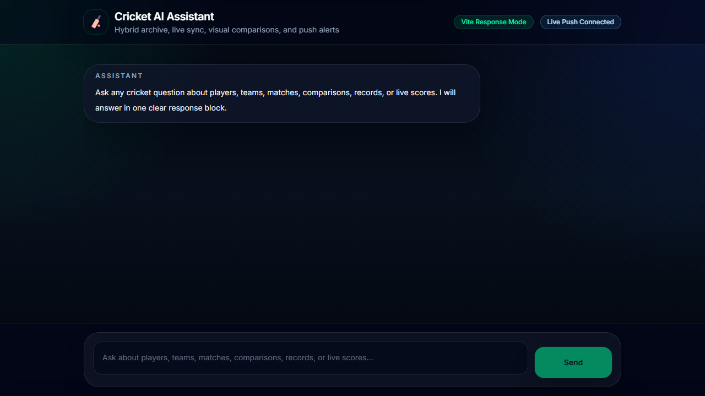

# Cricket Chat Bot Frontend

> **Status: Active Development** — The production bundle builds successfully; end-to-end behavior depends on the separate backend.

[](docs/demo/demo.webm)

> Watch the locally recorded interface overview and product architecture boundary.

React + Vite frontend for the Cricket Chat Bot. It provides a chat-style cricket assistant UI that sends natural-language questions to the backend, renders structured response cards, highlights detected cricket entities, displays charts when the backend supplies chart data, and listens for live match push alerts over Socket.IO.

## Overview

This frontend is the user-facing part of the Cricket Chat Bot system. It does not perform cricket data analysis by itself. Instead, it focuses on:

- collecting user questions
- calling the backend query API
- rendering the backend's normalized response format
- showing live connection state
- receiving live score or archive-sync alerts
- rendering player, team, match, record, comparison, squad, and playing-XI views

The backend is expected to run separately during development. In production-style usage, the backend can also serve the built frontend from `../frontend/dist`.

## Tech Stack

- React 19
- Vite
- Chart.js
- Socket.IO client
- Tailwind CDN utility classes configured in `index.html`
- Custom CSS in `styles.css`

## Project Structure

```text
frontend/
  index.html                 Vite HTML entry, Tailwind CDN config, font setup
  main.jsx                   React root bootstrap
  app.jsx                    App wrapper that renders Home
  styles.css                 Global dark theme, page background, scrollbar styles
  vite.config.js             Vite dev server and backend proxy config
  package.json               Frontend dependencies and npm scripts
  pages/
    Home.jsx                 Main chat page, backend calls, Socket.IO connection
  components/
    Header.jsx               App header and live push status
    ChatWindow.jsx           Chat thread, response card renderer, entity micro-cards
    InputBox.jsx             Message composer and submit handling
    ResponseChart.jsx        Chart.js renderer for backend chart payloads
    textParser.jsx           Entity-aware rich text parser
```

## Prerequisites

- Node.js 18 or newer
- npm
- Running backend service

The default development setup expects the backend on:

```text
http://localhost:3001
```

That value matches the backend `.env.example`. If your backend runs on another port, set `VITE_BACKEND_URL`.

## Installation

From the frontend folder:

```bash
cd frontend
npm install
```

## Environment Variables

Create `frontend/.env` only when you need to override defaults.

```env
VITE_BACKEND_URL=http://localhost:3001
VITE_SOCKET_URL=http://localhost:3001
```

### Variable Reference

| Variable | Default | Purpose |
| --- | --- | --- |
| `VITE_BACKEND_URL` | `http://localhost:3001` in dev, `window.location.origin` after build | Base URL for REST API calls |
| `VITE_SOCKET_URL` | same as `VITE_BACKEND_URL` | Base URL for Socket.IO live alerts |

Both values are normalized by removing trailing slashes.

## Running Locally

Start the backend first:

```bash
cd backend
npm install
npm start
```

Then start the frontend dev server:

```bash
cd frontend
npm install
npm run dev
```

Open:

```text
http://localhost:5173
```

## Development Proxy

`vite.config.js` proxies API and Socket.IO traffic to the backend.

```text
/api       -> VITE_BACKEND_URL
/socket.io -> VITE_BACKEND_URL with websocket support
```

This lets frontend code use relative routes such as `/api/cricbuzz/player-card` while still working through the Vite dev server.

## Available Scripts

```bash
npm run dev
npm run build
npm run preview
```

### Script Details

- `npm run dev`: starts the Vite development server on port `5173`.
- `npm run build`: creates the production build in `frontend/dist`.
- `npm run preview`: serves the production build locally for preview.

## Backend Dependency

The frontend uses these backend endpoints:

| Method | Endpoint | Used For |
| --- | --- | --- |
| `POST` | `/api/query` | Main natural-language cricket query |
| `GET` | `/api/cricbuzz/player-card?name=` | Clickable entity micro-card enrichment |
| Socket.IO | `/socket.io` | Live push connection and match alerts |

The backend also exposes other endpoints such as `/api/status`, `/api/home`, and `/api/cricapi/live-scores`, but the current frontend page primarily depends on the endpoints above.

## Request Flow

1. The user types a cricket question in `InputBox`.
2. `InputBox` appends the user message and a temporary status bubble.
3. `Home.submitQuestion()` sends the question to:

```text
POST {VITE_BACKEND_URL}/api/query
```

4. The backend returns a structured payload.
5. The status bubble is replaced by one assistant response card.
6. `ChatWindow` renders the card based on payload fields such as `type`, `title`, `summary`, `stats`, and `extra`.

## Query Payload

The frontend sends:

```json
{
  "question": "Compare Virat Kohli vs Rohit Sharma"
}
```

## Expected Response Shape

The frontend is built around the backend's unified response format:

```json
{
  "type": "comparison",
  "title": "Virat Kohli vs Rohit Sharma",
  "image": "",
  "summary": "Short cricket answer rendered in the main response body.",
  "stats": {
    "runs_left": 12000,
    "runs_right": 11000
  },
  "extra": {
    "action": "compare_players",
    "sources": ["Vector Archive"],
    "detected_entities": ["Virat Kohli", "Rohit Sharma"],
    "chartData": {
      "type": "radar",
      "labels": ["Runs", "Average", "Strike Rate"],
      "datasets": []
    }
  },
  "detected_entities": ["Virat Kohli", "Rohit Sharma"]
}
```

The exact fields vary by response type. The renderer is defensive and skips sections that are not present.

## Supported Response Types

The UI can render these normalized `type` values:

- `player`
- `team`
- `match`
- `comparison`
- `record`
- `playing_xi`
- `chat`

The backend action is also available at `extra.action`. Common actions include:

- `player_stats`
- `team_stats`
- `team_info`
- `team_squad`
- `playing_xi`
- `match_summary`
- `compare_players`
- `head_to_head`
- `top_players`
- `record_lookup`
- `glossary`
- `general_knowledge`
- `live_update`
- `subjective_analysis`

## UI Features

- Single-page chat experience
- Sticky message composer
- Temporary rotating status bubble while the backend processes a query
- Structured assistant cards with title, type badge, summary, sources, stats, charts, rows, squads, and match context
- Entity highlighting in summaries
- Clickable entity pills that open Cricbuzz-backed micro-cards
- Fallback player card handling when Cricbuzz data is unavailable
- Socket.IO live status badge in the header
- Live score and archive-sync alerts inserted into the chat thread
- Responsive layout for desktop and mobile

## Chart Rendering

`ResponseChart.jsx` renders charts only when the backend provides `extra.chartData`.

Expected chart payload:

```json
{
  "type": "bar",
  "title": "Run Comparison",
  "labels": ["Virat Kohli", "Rohit Sharma"],
  "datasets": [
    {
      "label": "Runs",
      "data": [12000, 11000],
      "color": "#22c55e"
    }
  ]
}
```

Supported chart types are the Chart.js types accepted by the installed Chart.js version, including `bar`, `line`, and `radar`.

## Entity Micro-Cards

When the backend returns detected entities, `ChatWindow` highlights matching text. Clicking an entity calls:

```text
GET /api/cricbuzz/player-card?name=<entity>
```

The micro-card can show:

- player image
- name
- team
- country
- role
- batting style
- bowling style
- short bio
- available stat snapshot

If Cricbuzz is disabled, missing, rate-limited, or not subscribed, the backend may return a local fallback profile.

## Socket.IO Live Alerts

`Home.jsx` connects to:

```text
VITE_SOCKET_URL
```

The backend emits `live-score-alert` events. The frontend ignores the initial `socket_ready` event and adds later useful alerts to the chat thread.

Typical alert payload:

```json
{
  "type": "live_snapshot",
  "match_id": "match-id",
  "title": "Live Match Alert",
  "summary": "Match status and score line"
}
```

## Production Build

Build the frontend:

```bash
cd frontend
npm run build
```

This writes files to:

```text
frontend/dist
```

The backend serves that folder when it exists:

```text
backend/server.js -> ../frontend/dist
```

After building, start the backend and open the backend URL, for example:

```text
http://localhost:3001
```

## Common Development Tasks

### Change the Backend URL

Create `frontend/.env`:

```env
VITE_BACKEND_URL=http://localhost:3000
VITE_SOCKET_URL=http://localhost:3000
```

Restart `npm run dev` after changing Vite env variables.

### Add a New Response Section

1. Add the data to the backend response under `extra`.
2. Update `ResponseCard` in `components/ChatWindow.jsx`.
3. Keep rendering optional so older responses still work.

### Add a New Chart

1. Return `extra.chartData` from the backend.
2. Use a Chart.js-compatible `type`, `labels`, and `datasets` structure.
3. `ResponseChart.jsx` will render it automatically.

## Troubleshooting

### Frontend Shows "Unable to reach the backend"

Check that the backend is running and that `VITE_BACKEND_URL` points to the correct port.

```bash
cd backend
npm start
```

Then verify:

```text
http://localhost:3001/api/status
```

### Socket Badge Says "Live Push Offline"

The Socket.IO connection is not open. Confirm:

- backend is running
- `VITE_SOCKET_URL` matches the backend URL
- the Vite proxy includes `/socket.io`
- the browser console has no websocket or CORS errors

### Entity Micro-Card Fails

This usually means the backend could not fetch Cricbuzz data or the entity is not a player. The backend may still return a fallback profile from the local archive.

### Charts Do Not Render

The backend response must include:

```json
{
  "extra": {
    "chartData": {
      "type": "bar",
      "labels": [],
      "datasets": []
    }
  }
}
```

If `chartData.type` is missing, the chart component intentionally renders nothing.

### Production Backend Shows "Frontend build not found"

Run:

```bash
cd frontend
npm run build
```

Then restart the backend.

## Example Questions

- `Virat Kohli stats`
- `Compare Virat Kohli vs Rohit Sharma`
- `India team summary`
- `India vs Australia head to head`
- `Show recent live scores`
- `Who won the 2011 World Cup?`
- `What is LBW?`
- `Top run scorers`

## Notes for Contributors

- Keep API calls centralized in `Home.jsx` unless the UI grows enough to justify a client module.
- Keep response sections optional; the backend can omit fields depending on provider availability.
- Do not store API keys in the frontend. All provider keys belong in the backend `.env`.
- The frontend is intentionally presentation-focused. Cricket routing, data retrieval, and synthesis belong in the backend.

## Related repositories

- **Frontend:** this repository — React/Vite interface, visualization, and live connection state.
- **Backend:** [Cricket_chatbot_Backend](https://github.com/badugujashwanth-create/Cricket_chatbot_Backend) — natural-language routing, datasets, providers, retrieval, and Socket.IO events.

See [docs/TEST_REPORT.md](docs/TEST_REPORT.md) for current verification and [docs/demo/DEMO_SCRIPT.md](docs/demo/DEMO_SCRIPT.md) for the shared product demo plan.

## License status

No license file is currently present. All rights remain with the copyright holder unless a license is added manually.
