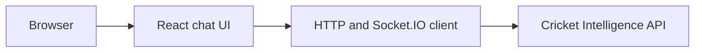

# Cricket Chatbot Web architecture

React chat interface for cricket questions, structured answers, charts, entity cards, and live Socket.IO status.

## System view

## Component boundaries

- **Browser:** initiates the primary workflow.
- **React chat UI:** owns one stage of the request or interaction flow.
- **HTTP and Socket.IO client:** owns one stage of the request or interaction flow.
- **Cricket Intelligence API:** provides the terminal integration or persistence boundary.

## Runtime and trust boundaries

The backend must be running and `VITE_API_URL` must target it; no frontend test suite is configured. Inputs crossing a network, filesystem, provider, or database boundary should be validated and logged without sensitive values. Optional integrations must fail clearly rather than being presented as successful.

## Technology

React, Vite, Chart.js, Socket.IO client.

